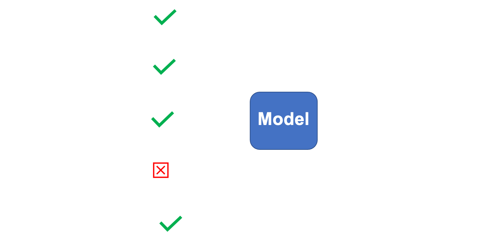
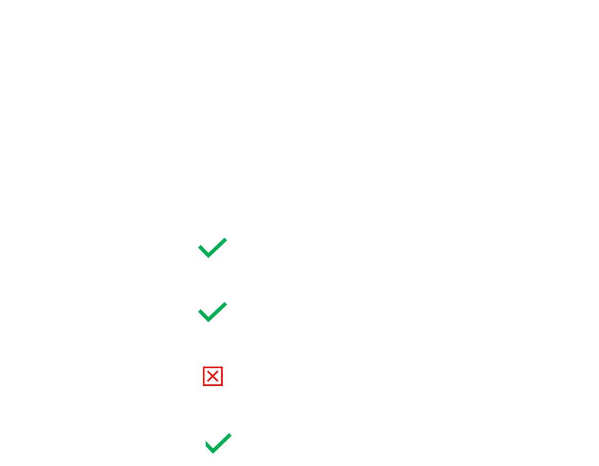
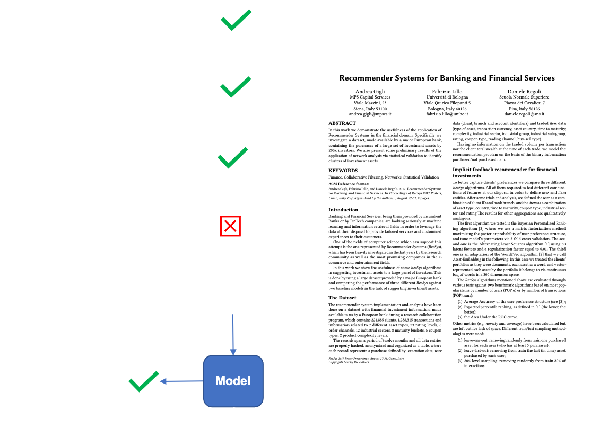
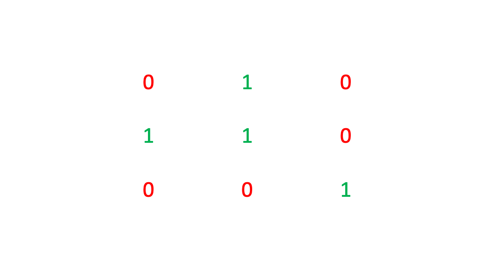
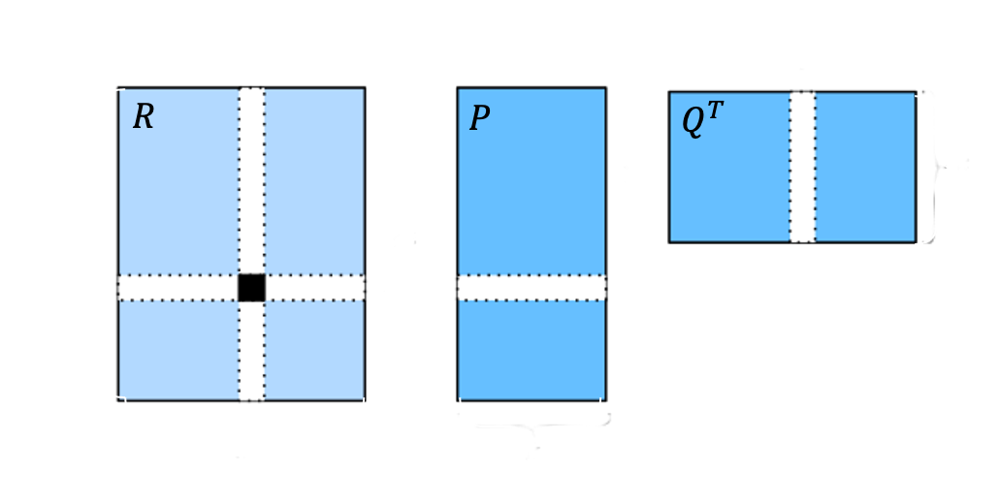
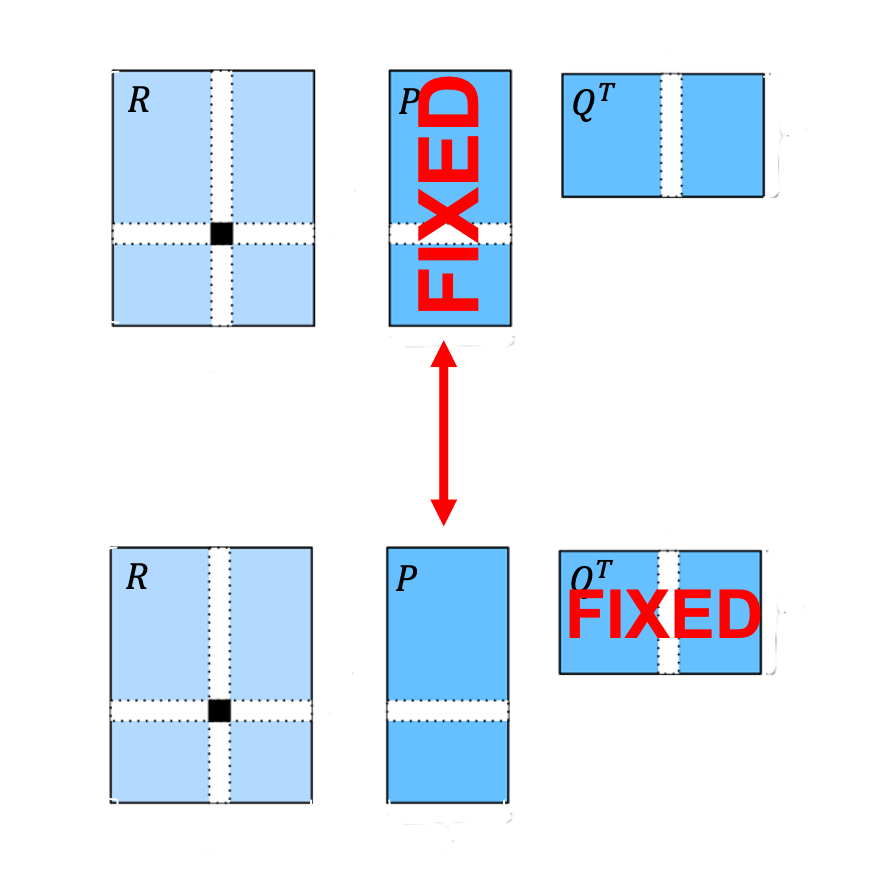
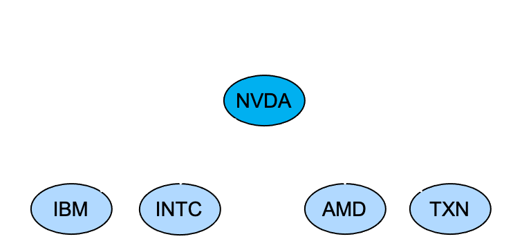

# **Personalized Stock Recommender Systems**

## **Contents**
RecSys for Banking and Financial Services:
1. Introduction
2. Goal
3. Drawbacks of Current Methods
4. Datasets
5. Method 1: Matrix Factorization with Bayesian Personalized Ranking
6. Method 2: Alternating Least Squares
7. Method 3: Word2Vec/CBOW

Training and Evaluating RecSys Models:
1. Dummy Dataset
2. Representative Dataset
<br/><br/>

# RecSys for Banking and Financial Services

## **Introduction**
Financial institutions are seriously looking to machine learning to provide tailored services and customized experiences to their customers.  Recommender systems (RecSys) are one class of algorithms to solve this problem.  These models are typically used in the realm of entertainment and e-commerce to recommend media or things to purchase, respectively. The paper [Recommender Systems for Banking and Financial Services](http://ceur-ws.org/Vol-1905/recsys2017_poster13.pdf) by Andrea Gigli, Fabrizio Lillo, and Daniele Regoli extends recommender systems to FinTech.

My project is to replicate this paper to the best of my ability.  Despite not having the data the author's do, the replicated models which I produce perform quite well on the data I do have.
<br/><br/>

## **Goal**
The question we are trying to answer is: given a portfolio of an investor's stocks, what stock is the investor most likely to invest in next?  This question has major applications to trading platforms like Fidelity and Robinhood, which could personalize recommendations to investors.
<p align="center">
<br/><br/>

<br/><br/>
</p>
In the graphic above, we have an investor on the left who has invested in tech companies like IBM, Intel, AMD and Google, but not in automotive companies like ford.  This information is given to a model which then outputs a list of stocks which it believes the investor is most likely to purchase.  We see that NVIDIA and Apple are at the top while General Motors is quite low.
<br/><br/>

## **Drawbacks of Current Methods**
Why is a new recommendation system needed, though, in the first place? Well, recommender systems in FinTech are relatively new, just becoming prevalent in the past five years or so:
- Financial institutions still typically conduct their own research  and provide opinions to investors
- At publication, many methods in the literature base their recommendations on broker research and news using NLP
- These models take a long time to train and are costly

Moreover, the literature tends towards explicit, un-personalized recommenders.  Explicit means that the information collected directly reflects explicit opinions of the investor.  Un-personalized means that the recommender provides the same recommendations to everyone, such as a popularity-based system.  Both of these things are unideal because explicit information is not always necessary and an un-personalized system is more disconnected from investors.  What we want is an implicit, personalized  recommender that is only given "purchased"/"not purchased" information.  This will lead to a happy investor and the firm implementing the recommender system to make more money, as illustrated in the graphic here. 
<p align="center">
    
    <br/><br/>
</p>

## **Recommender Systems to the Rescue**
At the 2017 ACM Recommender Systems conference, Gigli, Lillo, and Regoli showed that an *implicit* recommender system can predict preferences of users (investors) and the items (stocks) they purchase.  The showcased three different RecSys methods:
- Matrix factorization with Bayesian Personalized Ranking (BPR)
- Alternating Least Squares (ALS)
- Word2Vec/Continuous Bag of Words

The paper compares these algorithms against popularity methods that base their predictions solely on the popularity of different items (completely unpersonalized). 
<p align="center">
<br/><br/>

<br/><br/>
</p>

## **Datasets**
The data used for these recommendation systems is an interaction matrix between investors and the stocks they purchase.  More specificaly, we need a relation where each record is a transaction that has
- the investor identification number (```int```)
- the stock identification number (```int```)
- the timestamp of that transaction (```int```)

The interactions matrix itself should end up boiling down to somelike like the table below.
<p align="center">
<br/><br/>

<br/><br/>
</p>


### **Ideal Data**
The authors of the paper obtain this data from a European bank, where about 200,000 clients make 1.3 million transaction total.  Unfortunately, this data is proprietary and not available to us.  In this data's stead, we use two other datasets: a dummy dataset for testing the model and a representative dataset of transactions collected from UC Irvine.

### **Dummy Data**
To test to see if our model works, we will use the [MovieLens 100k](https://grouplens.org/datasets/movielens/100k/) dataset.  This dataset contains 100,000 records of about 1,000 different users each interacting with, on average, 100 movies from a population of 1,600 movies.  So, our interaction matrix will have a shape of approximately 1,000 rows by 1,600 columns.

### **Representative Dataset**
Orginially, I was going to use 13F forms submitted by hedge funds in Q4 2020 instead of users/stocks; however, the thousands of hedge funds I looked at invested from too large of a popultion of stocks.  This resulted in the interaction matrix becoming too scarce to make meaningful predictions.

Instead, I will use a dataset of historical online transactions collected from [UC Irvine](https://archive.ics.uci.edu/ml/datasets/online+retail).  This dataset contains approximately 540,000 records.
<br/><br/>

## **Method 1: Matrix Factorization with BPR [(Rendle et al., 2012)](https://arxiv.org/pdf/1205.2618.pdf)**
Matrix factorization (MF) is used because it captures the low-rank structure of linear investor-stock interactions.  In the figure below, we let $m, n, k \in \mathbb{N}$, where $m$ is the number of investors, $n$ is the number of stocks, and $k$ is the number of latent factors in $P$ and $Q$.
<p align="center">

<br/><br/>
</p>

The general model of MF is that there is an investor/stock interaction matrix $R$ which can be broken down into two latent matrices $P$ and $Q$.  MF finds these latent matrices using mean squared error and an optimizer such as Adam and uses it to predict unknown ratings.  However, in our case, since we are using *implicit* information, it is imperative that we use an optimization criterion such as Bayesian Personalized Ranking (BPR) over pairs of stocks for a particular investor when updating our model's parameters.  In this implicit scenario, the mulitplication of $P$ and $Q$ won't result in an explicit reconstruction of $R$, but rather a list of scores for each stock which we can then use to rank preferences.

To illustrate BPR, first let $I$ denote all stocks and $I^+$ denote purchased stocks.  Then, BPR is defined for pairs of stocks (per investor $u$) in the set
$$D:=\{(u, i, j)\ |\ i \in I_{u}^{+} \wedge j \in I \setminus I_{u}^{+} \}$$
Let's further define $\hat{y}$ as the binary prediction of "purchased" (1) or "not purchased" (0), $\lambda$ as the regularization hyperparameter, and $\Theta$ as the learned parameters.  Then BPR loss with L2-regularization is defined to be
$$\text{BPRLoss} := \sum_{u, i, j \in D}\ln(\sigma(\hat{y}_{ui} - \hat{y}_{uj}) - \lambda_\Theta ||\Theta||^2$$
where $\sigma$ is the sigmoid function.
<br/><br/>

### **Model Implementation in PyTorch**
The above logic is written in PyTorch in the file [mf_bpr.py](src/mf_bpr.py).  We first start with the model itself, which has two embeddings matrices as defined using ```nn.Embedding``` and then initialized via a normal distribution.  During the forward propagation step, ids corresponding to the investor and ids of the stocks they purchased are supplied.  The embeddings of these ids are obtained and the dot product of them are multiplied together to compute the scores.
```python
class MF_BPR(nn.Module):
    def __init__(self, investor_num: int, stock_num: int, latent_factors: int):
        """
        Initializes a matrix factorization model that is meant to be used in
        conjunction with Bayesian Personalized Recommendation loss.

        Parameters
        ----------
        investor_num (int) - number of investors\n
        stock_num (int) - number of stocks\n
        latent_factors (int) - number of latent factors
        """
        super(MF_BPR, self).__init__()
        self.embed_investor = nn.Embedding(investor_num, latent_factors)
        self.embed_stock = nn.Embedding(stock_num, latent_factors)

        nn.init.normal_(self.embed_investor.weight, std=0.01)
        nn.init.normal_(self.embed_stock.weight, std=0.01)

    def forward(self, investors: torch.Tensor, stocks: torch.Tensor) -> torch.Tensor:
        """
        Parameters
        ----------
        investors (torch.Tensor) - investor ids\n
        stocks (torch.Tensor) - ids of stocks that the investors purchased\n

        Output
        ------
        scores  (torch.Tensor) - scores of stocks that the investors may purchase next
        """
        investor = self.embed_investor(investors)
        stock_positive = self.embed_stock(stocks)
        scores = (investor * stock_positive).sum(dim=-1)

        return scores
```
The Bayesian Personalized ranking loss which accompanies the loss is constructed outside of the class.  Given score tensors of (investors, num_stocks), we aim to maximize the distance between the positive and negative scores:
```python
def BPR_Loss(positive : torch.Tensor, negative : torch.Tensor) -> torch.Tensor:
    """
    Given postive and negative examples, compute Bayesian Personalized ranking loss
    """
    distances = positive - negative
    loss = - torch.sum(torch.log(torch.sigmoid(distances)), 0, keepdim=True)

    return loss
```
<br/><br/>

## **Method 2: Alternating Least Squares [(Zhou et al., 2008)](https://doi.org/10.1007/978-3-540-68880-8_32)**
Alternating least squares is a distributed analog to matrix factorization.  It improves upon original matrix factorization by taking in implicit information and iteratively alternating between optimizing the latent investor matrix and fixing the latent stock matrix and vice versa.  This alternation in illustrated in the graphic on the right, where only one matrix is learned at a time.
<p align="center">

<br/><br/>
</p>

The benifit of fixing one matrix at a time is that it enables an analytical solution to the optimization problem.  Consider a mean squared error with L2-regularization:
$$\text{MSE} = \sum_{u, i}\left(R_{ui} - \hat{R}_{ui}\right)^2 + \lambda_\Theta||\Theta||^2$$
If $P$ is fixed, then the analaytical solution to the optimization problem is
$$Q = R^TP\left(P^TP + \lambda I_k\right)^{-1}$$
If $Q$ is fixed, then the analytical solution to the optimization problem is
$$P = R^TQ\left(Q^TQ + \lambda I_k\right)^{-1}$$
where $I_k$ is the identity matrix of dimension $k$.

Computing these analytical solutions is extremely fast compared to learning the latent factors in a approximate, gradient descent-like fashion.  Indeed, ALS is meant to be used in a distributed environment with Apache Spark in large scale environments for fast performance.
<br/><br/>

### **Model Implementation in NumPy**
The above logic is written in numpy in the file [als.py](src/als.py).  We first start with the model itself, which, like MF, has two embeddings matrices and then initialized via a normal distribution.  During the training step, we first assume the stock embedding matrix to be fixed and compute the investor embedding matrix via the first analytical solution above; then, we assume the investor embedding matrix to be fixed and compute the stock embedding via the second analytical solution above.  During predictions, we simply need to multiple to two embedding matricies together and obtain the corresponding (investor, stock) predictions.
```python
class ALS():
    def __init__(self, investor_num: int, stock_num: int, latent_factors: int,
                 train_data: np.ndarray, reg: float):
        """
        An Alternating Least Squares model which alternates between freezing the
        investor embedding matrix and the stock embedding matrix.

        Parameters
        ----------
        investor_num (int) - number of investors\n
        stock_num (int) - number of stocks\n
        latent_factors (int) - number of latent factors\n
        train_data (np.ndarray) - training data of shape (investor_num, stock_num)\n
        reg (float) - regularization factor
        """
        self.n_factors = latent_factors
        self.embed_investor = np.random.random((investor_num, latent_factors))
        self.embed_stock = np.random.random((stock_num, latent_factors))
        self.train_data = train_data
        self.reg = reg

    def train(self) -> None:
        """
        Train the ALS model by first fixing the stock embedding matrix and learning
        the investor embeddings and then the other way around.
        """
        # Train investor embeddings
        A_1 = np.matmul(self.embed_stock.T, self.embed_stock) + \
            np.eye(self.n_factors) * \
            self.reg  # (latent_factors, latent_factors)

        b_1 = np.matmul(self.train_data, self.embed_stock)
        self.embed_investor = np.matmul(b_1, np.linalg.inv(A_1))

        # Train stock embeddings
        A_2 = np.matmul(self.embed_investor.T, self.embed_investor) + \
            np.eye(self.n_factors) * \
            self.reg  # (latent_factors, latent_factors)
        b_2 = np.matmul(self.train_data.T, self.embed_investor)
        self.embed_stock = np.matmul(b_2, np.linalg.inv(A_2))

    def predict(self, user_ids: list, item_idxs: list) -> list:
        """
        Make matrix predictions using the ALS model
        """
        predictions = np.matmul(self.embed_investor, self.embed_stock.T)
        return [predictions[user_ids[i], item_idxs[i]] for i in range(len(user_ids))]
```
<br/><br/>

## **Method 3: Word2Vec/CBOW [(Mikolov et al. 2013a)](https://arxiv.org/abs/1301.3781)**
The Word2Vec model is typically used in NLP to create word embeddings for different words in a corpus of text over different documents.  Here, investors' portfolios are documents, and each stock is a word $w$ from a vocabulary $\mathcal{V}$.  There are two variants of Word2Vec, Skip-Gram and Continuous Bag of Words (CBOW), but the variant we're interested in is CBOW, as it allows us to predict whether one purchased stock is in an investor's portfolio.  The graphic on the left illustrates the objective of this model: given a portfolio of stocks like IBM, Intel, AMD, and Texas Instruments, we want to maximize the probability of another purchased tech stock like NVIDIA and minimize the probability of some random stock like General Motors.
<p align="center">

<br/><br/>
</p>

Let $\mathcal{W}_o$ be a set of context words (in a window of size $m$) and $u_c$, $v_o \in \mathbb{R}^d$ represent $d$-dimensional target word and context word embeddings, respectively.  Then, the conditional probability of a target word is simply the softmax of that target word:
$$\Pr(w_c\ |\ \mathcal{W}_0) = \frac{e^{u_c^Tv_o}}{\sum_{i \in \mathcal{V}}e^{u_i^Tv_o}}$$
The loss function for CBOW can be derived from the maximim likelihood estimation, where $L$ is the length of the portfolio and a word at time $t$ is $w^{(t)}$:
$$\text{CBOW-OPT} := \prod_{t = 1}^L\Pr\left(w^{(t)}\ |\ w^{(t-m)},\ldots, w^{(t-1)}, w^{(t+1)},\ldots,w^{(t+m)}\right)$$
<br/><br/>

### **Model Implementation in PyTorch**
The above logic is written in PyTorch in the file [word2vec.py](src/word2vec.py).  We first start with the model itself, which has...
- an embedding matrix of size (```vocab_size```, ```embedding_dim```) defined using ```nn.Embedding```
- an input linear layer defined using ```nn.Linear```.  It takes in ```context_size * embedding_dim``` number of inputs and produces ```128``` outputs for the hidden layer.
- a hidden layer defined using ```nn.Linear```.  It takes in ```128``` hidden inputs and produces ```vocab_size``` number of outputs.
  
During the forward propagation step, embeddings of the context stocks are computed and then passed into the multi-layer perceptron (MLP).  The output of this MLP is then given to ```F.log_softmax```, which computes the probabilities of each of the stocks.
```python
class CBOW(nn.Module):
    def __init__(self, vocab_size: int, embedding_dim: int, context_size: int):
        """
        Initialize a CBOW model. Adapted from https://srijithr.gitlab.io/post/word2vec/.

        Parameters
        ----------
        vocab_size (int) - the size of all stocks under consideration\n
        embedding_dim (int) - the size of the embedding dimension\n
        context_size (int) - the number of words used as context for prediction
        """
        super(CBOW, self).__init__()
        self.embeddings = nn.Embedding(vocab_size, embedding_dim)
        self.linear1 = nn.Linear(context_size * embedding_dim, 128)
        self.linear2 = nn.Linear(128, vocab_size)
        self.context_size = context_size
        self.embedding_dim = embedding_dim

    def forward(self, context_words: torch.Tensor) -> torch.Tensor:
        """
        Parameters
        ----------
        context_words (torch.Tensor) - a tensor of words ids used as context for prediction of
            the target

        Output
        ------
        log_probabilities (torch.Tensor) - a tensor of the probabilities of each word
            in the vocabulary
        """
        embeddings = self.embeddings(context_words).view((context_words.shape[0],
            self.context_size * self.embedding_dim))
        out1 = F.relu(self.linear1(embeddings))
        out2 = self.linear2(out1)
        log_probabilities = F.log_softmax(out2, dim=1)
        return log_probabilities
```
As we'll see later, the loss funciton being used in conjunction with ```CBOW``` is ```nn.NLLLoss```, which is the negative log likelihood loss used to train a classification problem with multiple classes.
<br/><br/>

# Training and Evaluating RecSys Models
First, let's import the relevant packages that will be used throughout

## **Model Efficacy Check with Dummy Dataset**
To start, let's read in the [dataset](data/dummy.data):
```python
# Read data
def read_dummy():
    dummy_data = pd.read_csv("data/dummy.data", sep='\t', 
        names = ["user_id", "item_id", "rating", "timestamp"], engine = "python")
    num_users = dummy_data.user_id.unique().shape[0]
    num_items = dummy_data.item_id.unique().shape[0]
    return dummy_data, num_users, num_items
```
